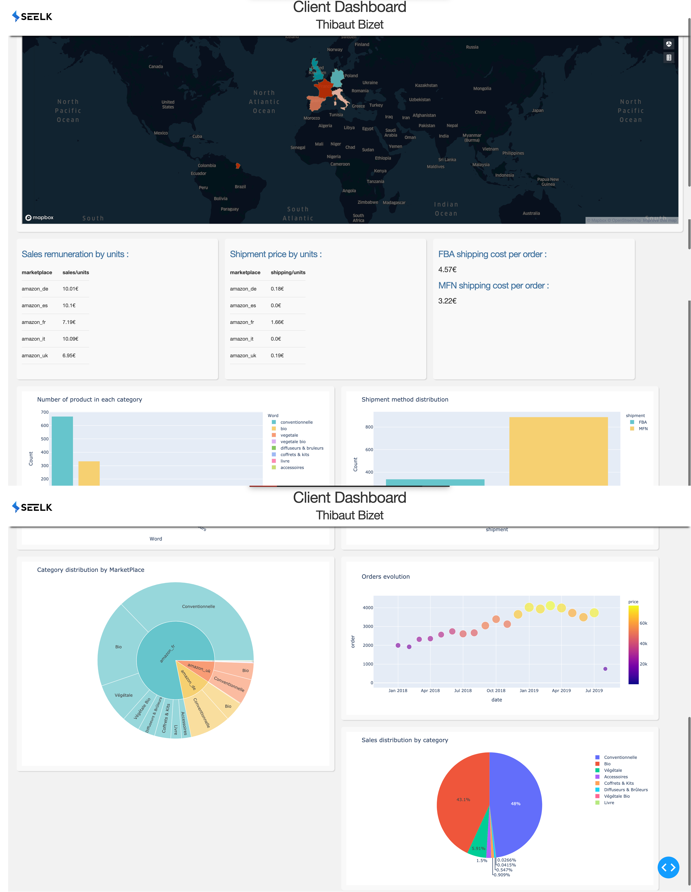

Librairies used: 
  -Dash
  -Plotly
  -Kepler.gl
  -psycopg2
  -sqlalchemy
  
Language Used :
  -HTML/CSS/Json
  -Python
  -SQL
  
You can access directly to the Dashboard thanks to this link : http://35.181.151.14:8050
I hosted the project thanks to AWS EC2
If the server is down, just let me know. I'll reboot it 

The code is running with the file "app.py"
You can see how i worked with the file "jupyter.html". Which is basically the report of my jupyter lab. 

You can run by yourself the program with the command "python app.py". This will create a server on the following IP : http://0.0.0.0:8050/

Overview :

