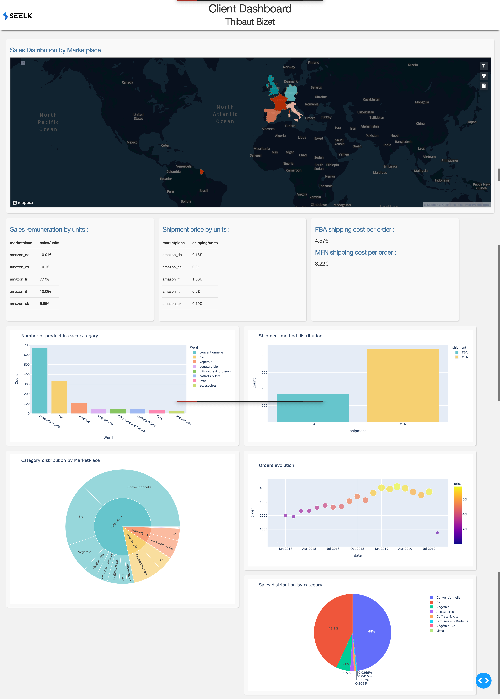

Librairies used: 
  -Dash
  -Plotly
  -Kepler.gl
  -psycopg2
  -sqlalchemy
  
Language Used :
  -HTML/CSS/Json
  -Python
  -SQL
  
You can access directly to the Dashboard thanks to this link : http://35.181.151.14:8050
I hosted the project thanks to AWS EC2

The code is running with the file "app.py"
You can see how i worked with the file "jupyter.html". Which is basically the report of my jupyter lab. 

Overview :

